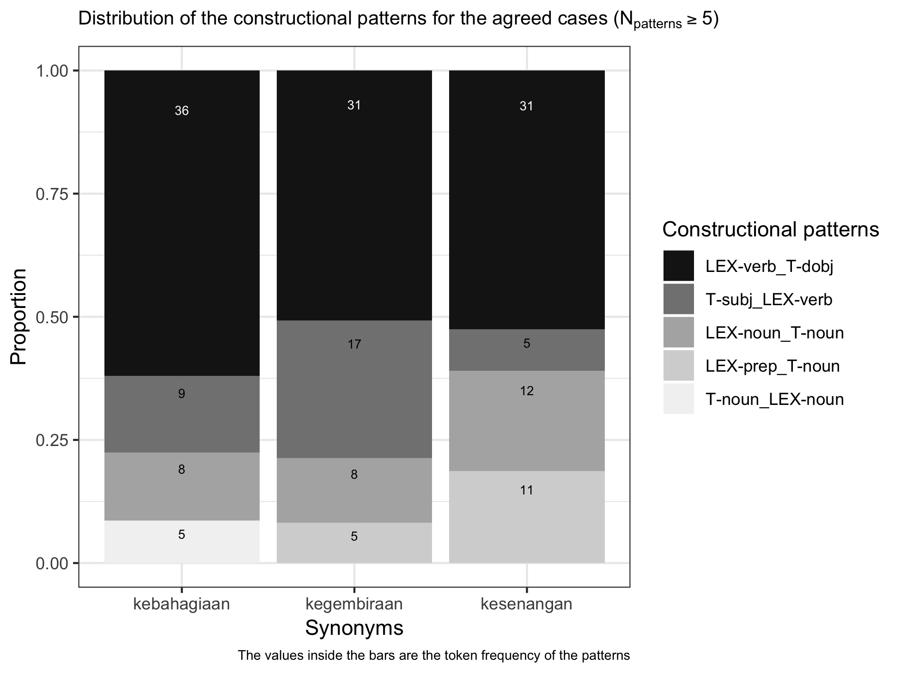
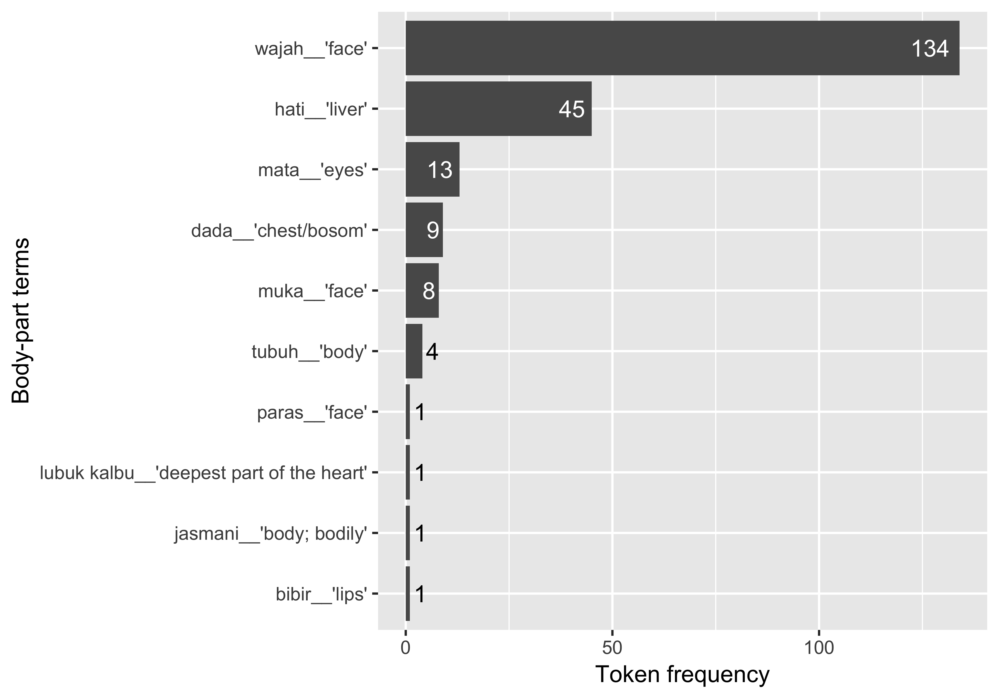

<!-- README.md is generated from README.Rmd. Please edit that file -->
[](https://travis-ci.org/gederajeg/happyr) [](https://ci.appveyor.com/project/gederajeg/happyr) [](https://codecov.io/github/gederajeg/happyr?branch=master)

happyr
======

The goal of `happyr` is to document the R codes and the required dataset for the quantitative analyses in Rajeg's ([2018](#ref-rajeg_metaphorical_2018)) PhD thesis (submitted for examination on 28 September 2018). The study focuses on metaphors for <span style="font-variant:small-caps;">happiness</span> near-synonyms in Indonesian. The corpus data for the study mainly come from the *Indonesian Leipzig Corpora Collection* (Biemann, Heyer, Quasthoff, & Richter, [2007](#ref-biemann_leipzig_2007); Goldhahn, Eckart, & Quasthoff, [2012](#ref-goldhahn_building_2012); Quasthoff & Goldhahn, [2013](#ref-quasthoff_indonesian_2013)). The Leipzig Corpora are freely available for [download](http://wortschatz.uni-leipzig.de/en/download) and their use is licensed under the Creative Common License [CC-BY](https://creativecommons.org/licenses/by/4.0/) (see the [Terms of Usage](http://wortschatz.uni-leipzig.de/en/usage) page for further details). The underlying codes within the `happyr` package are based on most of the core packages in the [`tidyverse`](https://www.tidyverse.org).

Acknowledgement
---------------

The thesis is supervised by Dr. [Alice Gaby](https://profiles.arts.monash.edu.au/alice-gaby/) (main), Dr. [Howard Manns](https://profiles.arts.monash.edu.au/howard-manns/) (associate), and Dr. [Simon Musgrave](https://profiles.arts.monash.edu.au/simon-musgrave/) (associate). It is fully funded by [Monash University](https://www.monash.edu), Australia through the [International Graduate Research Scholarships](https://www.monash.edu/graduate-research/future-students/scholarships).

Installation
------------

The `happyr` package can be installed from [GitHub](https://github.com/gederajeg/happyr) with the [`devtools`](https://cran.r-project.org/package=devtools) package:

``` r
# install the `devtools` package
install.packages("devtools") 

# install the `happyr` package
devtools::install_github("gederajeg/happyr")
```

Examples
--------

``` r
# load the required packages
library(happyr)
library(tidyverse)
#> ── Attaching packages ─────────────────────────────────────────────── tidyverse 1.2.1 ──
#> ✔ ggplot2 3.0.0     ✔ purrr   0.2.5
#> ✔ tibble  1.4.2     ✔ dplyr   0.7.6
#> ✔ tidyr   0.8.1     ✔ stringr 1.3.1
#> ✔ readr   1.1.1     ✔ forcats 0.3.0
#> ── Conflicts ────────────────────────────────────────────────── tidyverse_conflicts() ──
#> ✖ dplyr::filter() masks stats::filter()
#> ✖ dplyr::lag()    masks stats::lag()
```

### Interrater-agreement computation in Chapter 3

All codes for the Kappa's calculation in the interrater agreement trial are presented in the *Examples* section of the documentation of the `kappa_tidy()` function. Type `?kappa_tidy()` to see them.

The `ggplot2` code for producing Figure 3.1 in Rajeg ([2018](#ref-rajeg_metaphorical_2018), Ch. 3) is wrapped into a function called `plot_cxn_interrater()`. The input data frame is `top_cxn_data`.

``` r
# prepare plot title and caption
plot_title <- expression(paste("Distribution of the constructional patterns for the agreed cases (", N["patterns"] >= "5)", sep = ""))

plot_caption <- "The values inside the bars are the token frequency of the patterns"
  
plot_cxn_interrater(df = top_cxn_data) +
  # add plot title and caption
  labs(title = plot_title,
       caption = plot_caption) +
  # adjust the size of the plot title and caption
  theme(plot.title = element_text(size = 10),
        plot.caption = element_text(size = 7))
```



### Token frequency, type frequency, and type/token ratio analyses in Chapter 5 and 6

The main metaphor data for Chapter 5, 6, and 7 is stored as a tibble in `phd_data_metaphor`. The relevant function for the token, type, and type/token ratios analyses in Chapter 5 and 6 is `ttr()`.

``` r
# calculation for the token, type, and type/token ratios
ttr_metaphor <- ttr(df = phd_data_metaphor,
                    metaphor_var = "metaphors", # specify col.name of the metaphor variable
                    lexunit_var = "lu", # specify col.name of the lexical unit variable
                    float_digits = 2)
```

The following code retrieves the top-10 metaphors sorted according to their token frequencies. A function for rendering the metaphors strings as small-capital in the MS Word output is available in the package as `scaps()`.

``` r
top_n(x = ttr_metaphor, n = 10L, wt = token) %>% 
  mutate(metaphors = scaps(metaphors)) %>% # render the metaphors into small capitals to be printed in MS Word output
  knitr::kable(caption = "Top-10 most frequent metaphors", row.names = TRUE)
```

|     | metaphors                                                                                  |  token|  type\_lu|  perc\_token|  perc\_type\_lu|  type\_per\_token\_lu|
|-----|:-------------------------------------------------------------------------------------------|------:|---------:|------------:|---------------:|---------------------:|
| 1   | <span style="font-variant:small-caps;">happiness is a possessable object</span>            |    749|        63|        20.59|            7.84|                  8.41|
| 2   | <span style="font-variant:small-caps;">happiness is a contained entity</span>              |    358|        26|         9.84|            3.23|                  7.26|
| 3   | <span style="font-variant:small-caps;">happiness is a desired goal</span>                  |    293|        42|         8.05|            5.22|                 14.33|
| 4   | <span style="font-variant:small-caps;">happiness is an (un)veiled object</span>            |    211|        23|         5.80|            2.86|                 10.90|
| 5   | <span style="font-variant:small-caps;">happiness is a located object</span>                |    210|        26|         5.77|            3.23|                 12.38|
| 6   | <span style="font-variant:small-caps;">happiness is a location</span>                      |    169|        35|         4.65|            4.35|                 20.71|
| 7   | <span style="font-variant:small-caps;">happiness is a liquid in a container</span>         |    156|        37|         4.29|            4.60|                 23.72|
| 8   | <span style="font-variant:small-caps;">intensity of happiness is quantity of object</span> |    137|        29|         3.77|            3.61|                 21.17|
| 9   | <span style="font-variant:small-caps;">happiness is food</span>                            |    108|        17|         2.97|            2.11|                 15.74|
| 10  | <span style="font-variant:small-caps;">happiness is a submerged entity</span>              |     99|        12|         2.72|            1.49|                 12.12|

From the output of `ttr()` above (i.e. the `ttr_metaphor` table), we can retrieve the top-10 metaphors with high type frequencies (Rajeg, [2018](#ref-rajeg_metaphorical_2018), Ch. 6) with the following codes:

``` r
# sort by type frequency
productive_metaphor <- ttr_metaphor %>% 
  arrange(desc(type_lu)) %>% # sort in descending order for the type frequency
  top_n(10, type_lu) %>% # get the top-10 rows
  mutate(metaphors = scaps(metaphors)) # small-caps the metaphors texts

# print as table
productive_metaphor %>% 
select(Metaphors = metaphors,
       Token = token,
       `%Token` = perc_token,
       Type = type_lu,
       `%Type` = perc_type_lu) %>% 
  knitr::kable(caption = 'Top-10 metaphors sorted on their type frequency.', row.names = TRUE)
```

|     | Metaphors                                                                                  |  Token|  %Token|  Type|  %Type|
|-----|:-------------------------------------------------------------------------------------------|------:|-------:|-----:|------:|
| 1   | <span style="font-variant:small-caps;">happiness is a possessable object</span>            |    749|   20.59|    63|   7.84|
| 2   | <span style="font-variant:small-caps;">happiness is a desired goal</span>                  |    293|    8.05|    42|   5.22|
| 3   | <span style="font-variant:small-caps;">happiness is a liquid in a container</span>         |    156|    4.29|    37|   4.60|
| 4   | <span style="font-variant:small-caps;">happiness is a location</span>                      |    169|    4.65|    35|   4.35|
| 5   | <span style="font-variant:small-caps;">intensity of happiness is quantity of object</span> |    137|    3.77|    29|   3.61|
| 6   | <span style="font-variant:small-caps;">happiness is light</span>                           |     43|    1.18|    27|   3.36|
| 7   | <span style="font-variant:small-caps;">happiness is a contained entity</span>              |    358|    9.84|    26|   3.23|
| 8   | <span style="font-variant:small-caps;">happiness is a located object</span>                |    210|    5.77|    26|   3.23|
| 9   | <span style="font-variant:small-caps;">happiness is an (un)veiled object</span>            |    211|    5.80|    23|   2.86|
| 10  | <span style="font-variant:small-caps;">happiness is an imperilled entity</span>            |     32|    0.88|    21|   2.61|

I design a helper function called `get_lexically_diverse_metaphors()` to retrieve the top-10 lexically diverse or creative metaphors (Rajeg, [2018](#ref-rajeg_metaphorical_2018), Ch. 6). These metaphors are those having relatively high type/token ratios (normalised as percentage) and occurring at least three tokens in the sample.

``` r
min_freq <- 3L
ttr_metaphor %>% 
  get_lexically_diverse_metaphors(min_token = min_freq, top_n_limit = 10L) %>% 
  mutate(metaphors = scaps(metaphors)) %>% 
  select(Metaphors = metaphors,
         Token = token,
         Type = type_lu,
         `Type/token ratio (in%)` = type_per_token_lu) %>% 
  knitr::kable(caption = paste('Top-10 lexically varied metaphors sorted based on the TTR value and occurring at least ', happyr::numbers2words(min_freq), ' tokens.', sep = ""), row.names = TRUE)
```

|     | Metaphors                                                                        |  Token|  Type|  Type/token ratio (in%)|
|-----|:---------------------------------------------------------------------------------|------:|-----:|-----------------------:|
| 1   | <span style="font-variant:small-caps;">happiness is a harmful agent</span>       |     11|    11|                  100.00|
| 2   | <span style="font-variant:small-caps;">happiness is drugs</span>                 |      6|     6|                  100.00|
| 3   | <span style="font-variant:small-caps;">happiness is a moved entity</span>        |      4|     4|                  100.00|
| 4   | <span style="font-variant:small-caps;">happiness is a treatment tool</span>      |      3|     3|                  100.00|
| 5   | <span style="font-variant:small-caps;">happiness is an accompanied object</span> |      3|     3|                  100.00|
| 6   | <span style="font-variant:small-caps;">happiness is being soaked</span>          |      9|     8|                   88.89|
| 7   | <span style="font-variant:small-caps;">happiness is a resource</span>            |      8|     7|                   87.50|
| 8   | <span style="font-variant:small-caps;">happiness is impediment to motion</span>  |      6|     5|                   83.33|
| 9   | <span style="font-variant:small-caps;">happiness is a deceiver</span>            |     20|    16|                   80.00|
| 10  | <span style="font-variant:small-caps;">happiness is an adversary</span>          |     24|    19|                   79.17|

#### Retrieving the frequency of submappings, semantic source frames, and lexical units of metaphors

The data for retrieving the information on the submappings, source frames, and the lexical units is contained within `phd_data_metaphor`. Among the relevant functions for retrieving these information are `get_submappings()`, `get_frames()`, and `get_lu_table()`. The illustration is based on data for the <span style="font-variant:small-caps;">happiness is liquid in a container</span> metaphor.

``` r
# get the submappings for the liquid in a container
get_submappings(metaphor = "liquid in a container", df = phd_data_metaphor) %>% 
  mutate(submappings = scaps(submappings)) %>% 
  knitr::kable(caption = paste("Submappings for ", scaps("happiness is liquid in a container."), sep = ""), row.names = TRUE)
```

|     | submappings                                                                                                    |    n|  type|   perc|  type\_perc|
|-----|:---------------------------------------------------------------------------------------------------------------|----:|-----:|------:|-----------:|
| 1   | <span style="font-variant:small-caps;">expression of happiness is released liquid</span>                       |  100|    18|  64.10|       48.65|
| 2   | <span style="font-variant:small-caps;">intensified happiness is heated liquid</span>                           |   32|     4|  20.51|       10.81|
| 3   | <span style="font-variant:small-caps;">high intensity of happiness is fullness of liquid in a container</span> |   11|     6|   7.05|       16.22|
| 4   | <span style="font-variant:small-caps;">preventing happiness is impeding flowing substance</span>               |    5|     2|   3.21|        5.41|
| 5   | <span style="font-variant:small-caps;">happiness is a fluidic motion</span>                                    |    4|     4|   2.56|       10.81|
| 6   | <span style="font-variant:small-caps;">happiness is a liquid in a container</span>                             |    4|     3|   2.56|        8.11|

Column `n` shows the 'token frequency' of the submappings (with `perc` indicates the token's percentage). Meanwhile `type` shows the 'type frequency' of the submappings (i.e., the number of different lexical unit types evoking the corresponding submappings of a given metaphor).

Use `get_frames()` to retrieve frequency profiles of the source frames for a given metaphor:

``` r
# get the source frames evoked by the metaphorical expressions for the liquid in a container
get_frames(metaphor = "liquid in a container", df = phd_data_metaphor) %>% 
  mutate(frames = scaps(frames)) %>% 
  knitr::kable(caption = paste("Source frames for ", scaps("happiness is liquid in a container."), sep = ""), row.names = TRUE)
```

|     | frames                                                               |    n|  type|   perc|  type\_perc|
|-----|:---------------------------------------------------------------------|----:|-----:|------:|-----------:|
| 1   | <span style="font-variant:small-caps;">release liquid</span>         |  100|    18|  64.10|       48.65|
| 2   | <span style="font-variant:small-caps;">heating fluid</span>          |   32|     4|  20.51|       10.81|
| 3   | <span style="font-variant:small-caps;">fluid containment</span>      |   15|     9|   9.62|       24.32|
| 4   | <span style="font-variant:small-caps;">stop flow of substance</span> |    5|     2|   3.21|        5.41|
| 5   | <span style="font-variant:small-caps;">fluid motion</span>           |    4|     4|   2.56|       10.81|

To print the source frame *lexical units* in the metaphorical expressions of the metaphor, use `get_lu_table()`:

``` r
# print the top-10 Lexical Units of liquid in a container metaphor
get_lu_table(metaphor = "liquid in a container", 
             top_n_only = TRUE, 
             top_n_limit = 10L, 
             df = phd_data_metaphor) %>% 
  knitr::kable(caption = paste("Top-10 most frequent lexical units for ",
                               scaps("happiness is liquid in a container."), sep = ""),
               row.names = TRUE)
```

|     | Lexical\_units  | Gloss                     |    N|  Perc\_overall|
|-----|:----------------|:--------------------------|----:|--------------:|
| 1   | *terpancar*     | to be spurted out         |   43|          27.56|
| 2   | *luapan*        | overflow                  |   25|          16.03|
| 3   | *luapkan*       | to boil sth. over         |   21|          13.46|
| 4   | *pancarkan*     | to spurt sth.             |    9|           5.77|
| 5   | *meluap(-luap)* | to boil over              |    8|           5.13|
| 6   | *limpahkan*     | to brim liquid onto sth.  |    4|           2.56|
| 7   | *salurkan*      | to funnel sth.            |    4|           2.56|
| 8   | *bendung*       | to dam up sth.            |    3|           1.92|
| 9   | *pancaran*      | a spurting-out            |    3|           1.92|
| 10  | *berlimpah*     | to be brimming/aboundant  |    2|           1.28|
| 11  | *curahan*       | outpouring                |    2|           1.28|
| 12  | *limpahi*       | to brim sth. with liquid  |    2|           1.28|
| 13  | *meruap*        | to boil to froth/bubble   |    2|           1.28|
| 14  | *sumbat*        | to clog sth.              |    2|           1.28|
| 15  | *tampung*       | to collect-in (of liquid) |    2|           1.28|
| 16  | *tertuang*      | to be poured out          |    2|           1.28|
| 17  | *tuangkan*      | to pour out sth.          |    2|           1.28|

The column `Perc_overall` indicates the percentage of a given LU from the total tokens of the given metaphor. Based on the same data, it is also possible to retrieve a frequency table for the lexical units and the submappings they evoke for a given metaphor. Use `get_lu_submappings_table()` for this purpose.

``` r
get_lu_submappings_table(metaphor = "liquid in a container",
                         df = phd_data_metaphor) %>% 
  mutate(submappings = scaps(submappings), # small-cap the submapping
         lu = paste("*", lu, "*", sep = "")) %>% # italicised the printed lexical units 
  knitr::kable(caption = paste("Evoked submappings for the lexical units of the ",
                               scaps("happiness is liquid in a container"), " metaphor.", sep = ""),
               row.names = TRUE)
```

|     | submappings                                                                                                    | lu                       | lu\_gloss                    |    n|  perc\_expr\_overall|  perc\_expr\_by\_submappings|
|-----|:---------------------------------------------------------------------------------------------------------------|:-------------------------|:-----------------------------|----:|--------------------:|----------------------------:|
| 1   | <span style="font-variant:small-caps;">expression of happiness is released liquid</span>                       | *terpancar*              | to be spurted out            |   43|                27.56|                        43.00|
| 2   | <span style="font-variant:small-caps;">expression of happiness is released liquid</span>                       | *luapan*                 | overflow                     |   25|                16.03|                        25.00|
| 3   | <span style="font-variant:small-caps;">expression of happiness is released liquid</span>                       | *pancarkan*              | to spurt sth.                |    9|                 5.77|                         9.00|
| 4   | <span style="font-variant:small-caps;">expression of happiness is released liquid</span>                       | *salurkan*               | to funnel sth.               |    4|                 2.56|                         4.00|
| 5   | <span style="font-variant:small-caps;">expression of happiness is released liquid</span>                       | *pancaran*               | a spurting-out               |    3|                 1.92|                         3.00|
| 6   | <span style="font-variant:small-caps;">expression of happiness is released liquid</span>                       | *curahan*                | outpouring                   |    2|                 1.28|                         2.00|
| 7   | <span style="font-variant:small-caps;">expression of happiness is released liquid</span>                       | *tertuang*               | to be poured out             |    2|                 1.28|                         2.00|
| 8   | <span style="font-variant:small-caps;">expression of happiness is released liquid</span>                       | *tuangkan*               | to pour out sth.             |    2|                 1.28|                         2.00|
| 9   | <span style="font-variant:small-caps;">expression of happiness is released liquid</span>                       | *air bah*                | flood                        |    1|                 0.64|                         1.00|
| 10  | <span style="font-variant:small-caps;">expression of happiness is released liquid</span>                       | *alirkan*                | to flow and drain sth.       |    1|                 0.64|                         1.00|
| 11  | <span style="font-variant:small-caps;">expression of happiness is released liquid</span>                       | *lampiaskan*             | to gush sth. out             |    1|                 0.64|                         1.00|
| 12  | <span style="font-variant:small-caps;">expression of happiness is released liquid</span>                       | *memancar*               | to spurt                     |    1|                 0.64|                         1.00|
| 13  | <span style="font-variant:small-caps;">expression of happiness is released liquid</span>                       | *membual*                | to overflow/spurt out        |    1|                 0.64|                         1.00|
| 14  | <span style="font-variant:small-caps;">expression of happiness is released liquid</span>                       | *pelampiasan*            | to spurt out sth.            |    1|                 0.64|                         1.00|
| 15  | <span style="font-variant:small-caps;">expression of happiness is released liquid</span>                       | *tercurah*               | to be poured out             |    1|                 0.64|                         1.00|
| 16  | <span style="font-variant:small-caps;">expression of happiness is released liquid</span>                       | *teteskan*               | to drip sth.                 |    1|                 0.64|                         1.00|
| 17  | <span style="font-variant:small-caps;">expression of happiness is released liquid</span>                       | *titikkan*               | to drip sth.                 |    1|                 0.64|                         1.00|
| 18  | <span style="font-variant:small-caps;">expression of happiness is released liquid</span>                       | *tumpahkan*              | to spill sth.                |    1|                 0.64|                         1.00|
| 19  | <span style="font-variant:small-caps;">happiness is a fluidic motion</span>                                    | *mengalir*               | to flow                      |    1|                 0.64|                        25.00|
| 20  | <span style="font-variant:small-caps;">happiness is a fluidic motion</span>                                    | *resap.v*                | to seep into sth.            |    1|                 0.64|                        25.00|
| 21  | <span style="font-variant:small-caps;">happiness is a fluidic motion</span>                                    | *terlarut*               | to be washed-and-drawn away  |    1|                 0.64|                        25.00|
| 22  | <span style="font-variant:small-caps;">happiness is a fluidic motion</span>                                    | *terserap*               | to be soaked up/absorbed     |    1|                 0.64|                        25.00|
| 23  | <span style="font-variant:small-caps;">happiness is a liquid in a container</span>                             | *tampung*                | to collect-in (of liquid)    |    2|                 1.28|                        50.00|
| 24  | <span style="font-variant:small-caps;">happiness is a liquid in a container</span>                             | *dicarikan jalan keluar* | to be searched for a way out |    1|                 0.64|                        25.00|
| 25  | <span style="font-variant:small-caps;">happiness is a liquid in a container</span>                             | *mendarah daging*        | to be internalised           |    1|                 0.64|                        25.00|
| 26  | <span style="font-variant:small-caps;">high intensity of happiness is fullness of liquid in a container</span> | *limpahkan*              | to brim liquid onto sth.     |    4|                 2.56|                        36.36|
| 27  | <span style="font-variant:small-caps;">high intensity of happiness is fullness of liquid in a container</span> | *berlimpah*              | to be brimming/aboundant     |    2|                 1.28|                        18.18|
| 28  | <span style="font-variant:small-caps;">high intensity of happiness is fullness of liquid in a container</span> | *limpahi*                | to brim sth. with liquid     |    2|                 1.28|                        18.18|
| 29  | <span style="font-variant:small-caps;">high intensity of happiness is fullness of liquid in a container</span> | *aliri*                  | to overflow sth. with liquid |    1|                 0.64|                         9.09|
| 30  | <span style="font-variant:small-caps;">high intensity of happiness is fullness of liquid in a container</span> | *kelimpahan*             | the brimming of sth.         |    1|                 0.64|                         9.09|
| 31  | <span style="font-variant:small-caps;">high intensity of happiness is fullness of liquid in a container</span> | *limpahan*               | the brimming of sth.         |    1|                 0.64|                         9.09|
| 32  | <span style="font-variant:small-caps;">intensified happiness is heated liquid</span>                           | *luapkan*                | to boil sth. over            |   21|                13.46|                        65.62|
| 33  | <span style="font-variant:small-caps;">intensified happiness is heated liquid</span>                           | *meluap(-luap)*          | to boil over                 |    8|                 5.13|                        25.00|
| 34  | <span style="font-variant:small-caps;">intensified happiness is heated liquid</span>                           | *meruap*                 | to boil to froth/bubble      |    2|                 1.28|                         6.25|
| 35  | <span style="font-variant:small-caps;">intensified happiness is heated liquid</span>                           | *membludak*              | to boil over to overflow     |    1|                 0.64|                         3.12|
| 36  | <span style="font-variant:small-caps;">preventing happiness is impeding flowing substance</span>               | *bendung*                | to dam up sth.               |    3|                 1.92|                        60.00|
| 37  | <span style="font-variant:small-caps;">preventing happiness is impeding flowing substance</span>               | *sumbat*                 | to clog sth.                 |    2|                 1.28|                        40.00|

The column `perc_expr_overall` indicates the percentages of the token frequencies the lexical units for the given metaphor. Meanwhile `perc_expr_by_submappings` indicates the percentages of the lexical units for each submapping of the given metaphor.

#### Visualising the frequency of occurrences for the body-part terms in the metaphorical expressions

The function for generating Figure 5.1 in Chapter 5 is `plot_body_part()` with `phd_data_metaphor` as the only input argument:

``` r
plot_body_part(df = phd_data_metaphor)
```



The following codes are used to generate the most-frequent co-occurrence of body-part terms and metaphors in Chapter 5:

``` r
# body-part gloss
bp_gloss <- tibble(gloss = c('chest/bosom', 'self', 'liver', 'eyes', 'face', 'body', 'face', 'face', 'deepest part of the heart', 'lips', 'mouth', 'body; bodily'), 
                   body_part_terms = c('dada', 'diri', 'hati', 'mata', 'muka', 'tubuh', 'wajah', 'paras', 'lubuk kalbu', 'bibir', 'mulut', 'jasmani'))

# generate the table
phd_data_metaphor %>% 
  filter(body_part_inclusion %in% c('y')) %>% 
  count(body_part_terms, metaphors) %>% 
  arrange(desc(n)) %>% 
  left_join(bp_gloss, by = 'body_part_terms') %>% # join the glossing tibble
  select(metaphors, body_part_terms, gloss, n) %>% 
  mutate(metaphors = scaps(metaphors), 
         body_part_terms = paste("*", body_part_terms, "* '", gloss, "'", sep = "")) %>%
  select(Body_parts = body_part_terms, Metaphors = metaphors, N = n) %>%
  top_n(10, N) %>%
  knitr::kable(caption = 'The ten most frequent <span style="font-variant:small-caps;">Body-part</span>`*`<span style="font-variant:small-caps;">Metaphors</span> co-occurrence for <span style="font-variant:small-caps;">Happiness</span> in Indonesian.', row.names = TRUE)
```

|     | Body\_parts          | Metaphors                                                                          |    N|
|-----|:---------------------|:-----------------------------------------------------------------------------------|----:|
| 1   | *wajah* 'face'       | <span style="font-variant:small-caps;">happiness is an (un)veiled object</span>    |   45|
| 2   | *wajah* 'face'       | <span style="font-variant:small-caps;">happiness is a liquid in a container</span> |   27|
| 3   | *hati* 'liver'       | <span style="font-variant:small-caps;">happiness is a contained entity</span>      |   17|
| 4   | *wajah* 'face'       | <span style="font-variant:small-caps;">happiness is a contained entity</span>      |   12|
| 5   | *wajah* 'face'       | <span style="font-variant:small-caps;">happiness is a located object</span>        |    8|
| 6   | *wajah* 'face'       | <span style="font-variant:small-caps;">happiness is an embellishment</span>        |    8|
| 7   | *wajah* 'face'       | <span style="font-variant:small-caps;">happiness is light</span>                   |    8|
| 8   | *dada* 'chest/bosom' | <span style="font-variant:small-caps;">happiness is a contained entity</span>      |    7|
| 9   | *mata* 'eyes'        | <span style="font-variant:small-caps;">happiness is a liquid in a container</span> |    7|
| 10  | *wajah* 'face'       | <span style="font-variant:small-caps;">happiness is a drawing</span>               |    7|

### Identifying the distinctive metaphors and the distinctive collocates in Chapter 7

The distinctiveness of a given metaphor and collocate with each happiness synonym is measured using the *Multiple Distinctive Collexeme Analysis* (MDCA) (cf., e.g., Hilpert, [2006](#ref-hilpert_distinctive_2006); Stefanowitsch, [2013](#ref-hoffmann_collostructional_2013), pp. 299–300). The MDCA function is available as `mdca()`.

``` r
# MDCA for metaphor * synonyms with concise output
mdca_res <- mdca(df = phd_data_metaphor, coll_var = "metaphors", concise_output = TRUE)
```

The data for the collocates are available in the `colloc_input_data`. The English gloss/translation for the distinctive collocates are stored in `dist_colloc_gloss`.

``` r
# mdca for window-span collocational data
mdca_colloc <- mdca(df = colloc_input_data, coll_var = "collocates", concise_output = TRUE)
```

The package also provides two related functions to retrieve the *attracted*/*distinctive* and the *repelled* items from the results of MDCA for the metaphors and collocates. They are `mdca_attr()` and `mdca_repel()`. The following example shows how to get the distinctive metaphors for *kebahagiaan* 'happiness' having the association strength of equal to, or greater than, two (i.e. *p*<sub>binomial</sub> &lt; 0.01):

``` r
mdca_res %>%
  mdca_attr(cxn_type = "kebahagiaan", min_assocstr = 2) %>% 
  mutate(exp = round(exp, 3L), # round the expected co-occurrence frequency
         metaphors = scaps(metaphors)) %>% 
  select(-synonyms) %>%
  as.data.frame() %>% 
  knitr::kable(caption = "Distinctive metaphors for *kebahagiaan* 'happiness'", row.names = TRUE)
```

|     | metaphors                                                                                  |    n|      exp|  assocstr| p\_binomial | p\_holm   | dec    |
|-----|:-------------------------------------------------------------------------------------------|----:|--------:|---------:|:------------|:----------|:-------|
| 1   | <span style="font-variant:small-caps;">happiness is a desired goal</span>                  |  125|   55.169|    20.208| 6.190e-21   | 3.838e-18 | \*\*\* |
| 2   | <span style="font-variant:small-caps;">intensity of happiness is object's dimension</span> |   23|   10.733|     3.867| 1.357e-04   | 8.032e-02 | ms     |
| 3   | <span style="font-variant:small-caps;">happiness is a possessable object</span>            |  181|  141.029|     3.767| 1.711e-04   | 1.011e-01 | ns     |
| 4   | <span style="font-variant:small-caps;">happiness is a moving object to a goal</span>       |   19|    9.979|     2.577| 2.650e-03   | 1.000e+00 | ns     |

The `p_holm` column provides the Holm's corrected significance level (Gries, [2009](#ref-gries_statistics_2009), pp. 249, 251) of the Binomial Test *p*-value (`p_binomial`) used as the basis for the association strength value (`assocstr`) (cf. Stefanowitsch, [2013](#ref-hoffmann_collostructional_2013), p. 305), which is derived via the log-transformed *p*<sub>Binomial</sub>-value to the base of 10. The `dec` column indicates the significane of the association between the metaphor and *kebahagiaan* 'happiness' at the corrected level. Column `exp` shows the 'expected' co-occurrence frequency of the metaphor with *kebahagiaan* while `n` is the 'observed' co-occurrence frequency in the sample.

The following code shows how to use `mdca_repel()` for *kebahagiaan* 'happiness' data:

``` r
mdca_res %>%
  mdca_repel(cxn_type = "kebahagiaan", min_assocstr = -2) %>% 
  mutate(exp = round(exp, 3L),
         metaphors = scaps(metaphors)) %>% 
  select(-synonyms) %>%
  knitr::kable(caption = "Repelled metaphors for *kebahagiaan* 'happiness'", row.names = TRUE)
```

|     | metaphors                                                                           |    n|     exp|  assocstr| p\_binomial | p\_holm   | dec    |
|-----|:------------------------------------------------------------------------------------|----:|-------:|---------:|:------------|:----------|:-------|
| 1   | <span style="font-variant:small-caps;">happiness is an (un)veiled object</span>     |   14|  39.729|    -6.440| 3.629e-07   | 2.203e-04 | \*\*\* |
| 2   | <span style="font-variant:small-caps;">happiness is a contained entity</span>       |   34|  67.408|    -6.099| 7.959e-07   | 4.815e-04 | \*\*\* |
| 3   | <span style="font-variant:small-caps;">happiness is a submerged entity</span>       |    5|  18.641|    -4.183| 6.566e-05   | 3.913e-02 | \*     |
| 4   | <span style="font-variant:small-caps;">happiness is (un)mixed substance</span>      |    3|  10.544|    -2.427| 3.739e-03   | 1.000e+00 | ns     |
| 5   | <span style="font-variant:small-caps;">happiness is a restrained/tied entity</span> |    0|   4.896|    -2.356| 4.410e-03   | 1.000e+00 | ns     |
| 6   | <span style="font-variant:small-caps;">happiness is a liquid in a container</span>  |   17|  29.373|    -2.286| 5.171e-03   | 1.000e+00 | ns     |
| 7   | <span style="font-variant:small-caps;">happiness is a location</span>               |   20|  31.821|    -2.001| 9.974e-03   | 1.000e+00 | ns     |

Finally, below is the code to retrieve the top-20 most distinctive collocates co-occurring with *kebahagiaan* 'happiness' within the span of 4 words to the left and right of *kebahagiaan*.

``` r
# present the result table for collocational analysis for *kebahagiaan*
mdca_attr(mdca_colloc, cxn_type = '^kebahagiaan') %>% 
  top_n(20, assocstr) %>% 
  left_join(dist_colloc_gloss, by = "collocates") %>% # left-join the gloss for the distinctive collocates
  select(-synonyms) %>%
  select(collocates, gloss, everything()) %>%
  mutate(exp = round(exp, 3), 
         collocates = paste("*", collocates, "*", sep = "")) %>%
  knitr::kable(caption="The 20 most distinctive, 4-window span collocates for *kebahagiaan* 'happiness' in the whole Indonesian Leipzig Corpora collection.", row.names = TRUE)
```

|     | collocates      | gloss                   |    n|      exp|  assocstr| p\_binomial | p\_holm   | dec    |
|-----|:----------------|:------------------------|----:|--------:|---------:|:------------|:----------|:-------|
| 1   | *kesejahteraan* | welfare; well-being     |   82|   32.701|    29.646| 2.258e-30   | 1.646e-25 | \*\*\* |
| 2   | *sejati*        | true; genuine           |   89|   37.703|    26.595| 2.538e-27   | 1.850e-22 | \*\*\* |
| 3   | *mencapai*      | to reach                |   87|   42.704|    16.944| 1.136e-17   | 8.282e-13 | \*\*\* |
| 4   | *akhirat*       | hereafter; afterlife    |   66|   29.624|    16.829| 1.482e-17   | 1.080e-12 | \*\*\* |
| 5   | *kesuksesan*    | success                 |   42|   18.467|    11.562| 2.745e-12   | 2.000e-07 | \*\*\* |
| 6   | *kedamaian*     | peace                   |   56|   27.315|    11.358| 4.389e-12   | 3.198e-07 | \*\*\* |
| 7   | *menemukan*     | to find; to locate      |   68|   35.394|    11.260| 5.496e-12   | 4.005e-07 | \*\*\* |
| 8   | *manusia*       | human                   |   87|   50.399|    10.034| 9.257e-11   | 6.745e-06 | \*\*\* |
| 9   | *hidup*         | life                    |  172|  116.956|     9.889| 1.290e-10   | 9.401e-06 | \*\*\* |
| 10  | *abadi*         | eternal                 |   49|   24.238|     9.626| 2.365e-10   | 1.723e-05 | \*\*\* |
| 11  | *tangga*        | stair                   |   37|   16.928|     9.191| 6.447e-10   | 4.697e-05 | \*\*\* |
| 12  | *menuju*        | to head to              |   45|   22.314|     8.829| 1.483e-09   | 1.081e-04 | \*\*\* |
| 13  | *hakiki*        | true; real; intrinsic   |   26|   10.772|     8.610| 2.452e-09   | 1.786e-04 | \*\*\* |
| 14  | *dunia*         | the world               |  132|   88.486|     8.302| 4.992e-09   | 3.637e-04 | \*\*\* |
| 15  | *keselamatan*   | safety                  |   32|   14.619|     8.049| 8.939e-09   | 6.512e-04 | \*\*\* |
| 16  | *kesehatan*     | health                  |   35|   16.543|     7.982| 1.041e-08   | 7.584e-04 | \*\*\* |
| 17  | *meraih*        | to catch-hold of        |   45|   23.853|     7.274| 5.322e-08   | 3.876e-03 | \*\*   |
| 18  | *umat*          | followers of a religion |   26|   11.542|     7.151| 7.063e-08   | 5.144e-03 | \*\*   |
| 19  | *orang*         | people                  |  120|   82.331|     6.855| 1.396e-07   | 1.016e-02 | \*     |
| 20  | *merasakan*     | to feel                 |   92|   60.017|     6.752| 1.769e-07   | 1.288e-02 | \*     |

References
----------

Biemann, C., Heyer, G., Quasthoff, U., & Richter, M. (2007). The Leipzig Corpora Collection: Monolingual corpora of standard size. In M. Davies, P. Rayson, S. Hunston, & P. Danielsson (Eds.), *Proceedings of the Corpus Linguistics Conference*. University of Birmingham, UK. Retrieved from <http://ucrel.lancs.ac.uk/publications/CL2007/paper/190_Paper.pdf>

Goldhahn, D., Eckart, T., & Quasthoff, U. (2012). Building large monolingual dictionaries at the Leipzig Corpora Collection: From 100 to 200 languages. In *Proceedings of the 8th Language Resources and Evaluation Conference (LREC) 2012* (pp. 759–765). Istanbul. Retrieved from <http://www.lrec-conf.org/proceedings/lrec2012/pdf/327_Paper.pdf>

Gries, S. T. (2009). *Statistics for linguistics with R: A practical introduction*. Berlin: Mouton de Gruyter.

Hilpert, M. (2006). Distinctive collexeme analysis and diachrony. *Corpus Linguistics and Linguistic Theory*, *2*(2), 243–256.

Quasthoff, U., & Goldhahn, D. (2013). *Indonesian corpora* (Technical report series on corpus building No. 7). Leipzig, Germany: Abteilung Automatische Sprachverarbeitung, Institut für Informatik, Universität Leipzig. Retrieved from <http://asvdoku.informatik.uni-leipzig.de/corpora/data/uploads/corpus-building-vol7-ind.pdf>

Rajeg, G. P. W. (2018). *Metaphorical profiles and near-synonyms: A corpus-based study of Indonesian words for <span style="font-variant:small-caps;">Happiness</span>* (PhD thesis). Monash University, Australia, Clayton, VIC.

Stefanowitsch, A. (2013). Collostructional analysis. In T. Hoffmann & G. Trousdale (Eds.), *The Oxford handbook of Construction Grammar* (pp. 290–306). Oxford: Oxford University Press. doi:[10.1093/oxfordhb/9780195396683.013.0016](https://doi.org/10.1093/oxfordhb/9780195396683.013.0016)
