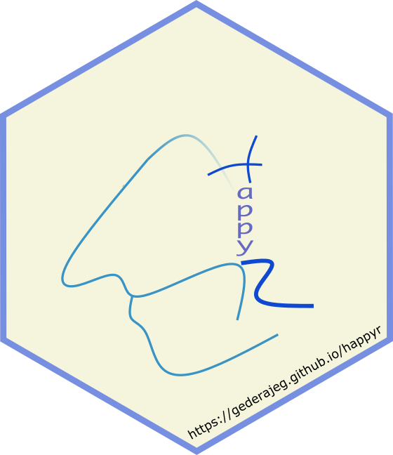

<!-- README.md is generated from README.Rmd. Please edit that file -->

[](https://github.com/gederajeg/happyr/actions)
[](https://codecov.io/github/gederajeg/happyr?branch=master)
[](https://doi.org/10.5281/zenodo.1436330)

# happyr <a href='https://gederajeg.github.io/happyr/'></a>

The goal of **happyr** is to document the R codes and the dataset for
the quantitative analyses in Rajeg’s
([2019](#ref-rajeg_metaphorical_2018)) PhD thesis (submitted for
examination on 27 September 2018 and passed without amendments for the
award of the degree on 1 April 2019). The study focuses on metaphors for
<span class="smallcaps">happiness</span> near-synonyms in Indonesian.
The corpus data for the study mainly come from the *Indonesian Leipzig
Corpora Collection* ([Quasthoff & Goldhahn
2013](#ref-quasthoff_indonesian_2013); [Goldhahn, Eckart & Quasthoff
2012](#ref-goldhahn_building_2012); [Biemann et al.
2007](#ref-biemann_leipzig_2007)). The Leipzig Corpora are freely
available for [download](http://wortschatz.uni-leipzig.de/en/download)
and their use is licensed under the Creative Common License
[CC-BY](https://creativecommons.org/licenses/by/4.0/) (see the [Terms of
Usage](http://wortschatz.uni-leipzig.de/en/usage) page for further
details).

The **happyr** package is based on the core packages in the
[tidyverse](https://www.tidyverse.org), and is built under R version
4.0.5 (2021-03-31) – “Shake and Throw” (see the [**Session
Info**](#session-info) section at the bottom of the page for further
details on the dependencies).

## Acknowledgement

The thesis was supervised by Associate Professor [Alice
Gaby](https://bit.ly/2D91Lp9) (main), Dr. [Howard
Manns](https://bit.ly/2UelYPY) (associate), and Dr. [Simon
Musgrave](https://bit.ly/2Z1tCAV) (associate). The panel members during
the author’s candidature milestones consisted of Dr. [Anna
Margetts](https://research.monash.edu/en/persons/anna-margetts),
Dr. [Réka Benczes](https://www.researchgate.net/profile/Reka_Benczes),
and Prof. [John Newman](https://www.johnnewm.org). The two external
examiners of the thesis were Prof. [Martin
Hilpert](http://members.unine.ch/martin.hilpert/) (Université de
Neuchâtel, Switzerland) and Dr. [Karen
Sullivan](https://languages-cultures.uq.edu.au/profile/1106/kari-sullivan)
(The University of Queensland, Australia) The PhD research of the author
was fully funded by [Monash University](https://www.monash.edu),
Australia through the [International Graduate Research
Scholarships](https://www.monash.edu/graduate-research/future-students/scholarships)
schemes (i.e. *Monash International Postgraduate Research Scholarships*
(MIPRS, now MITS) and *Monash Graduate Scholarships* (MGS)). The author
also benefited from generous research and travel funding provided by the
[Monash Arts Graduate
Research](https://arts.monash.edu/graduate-research/) and the [Monash
Graduate Research Office](https://www.monash.edu/graduate-research).

## Installation

The **happyr** package can be installed from
[GitHub](https://github.com/gederajeg/happyr) with the
[remotes](https://cran.r-project.org/web/packages/remotes/index.html)
package:

``` r
# Install remotes if needed
if(!require(remotes)) install.packages("remotes")

# Then, install the happyr package from GitHub
remotes::install_github("gederajeg/happyr")
```

## Citing *happyr*

``` r
citation("happyr")
#> 
#> To cite `happyr` in publication (if in 'Unified style sheet for
#> linguistics' style), please use:
#> 
#>   Rajeg, Gede Primahadi Wijaya. 2019. happyr: The accompanying R
#>   package for Rajeg's (2019) PhD Thesis titled "Metaphorical profiles
#>   and near synonyms: A corpus-based study of Indonesian words for
#>   HAPPINESS". R package version 1.0.
#>   http://doi.org/10.5281/zenodo.1436330.
#>   https://gederajeg.github.io/happyr/
#> 
#> Please also cite the document (PhD Thesis) associated with the package
#> as follows (still if in 'Unified style sheet for linguistics' style):
#> 
#>   Rajeg, Gede Primahadi Wijaya. 2019. Metaphorical profiles and
#>   near-synonyms: A corpus-based study of Indonesian words for
#>   HAPPINESS. Clayton, VIC: Monash University, Australia PhD thesis.
#>   http://doi.org/10.26180/5cac231a97fb1.
#> 
#> To see these entries in BibTeX format, use 'print(<citation>,
#> bibtex=TRUE)', 'toBibtex(.)', or set
#> 'options(citation.bibtex.max=999)'.
```

## Examples

First, load the **happyr** and **tidyverse** packages using the
`library()` function.

``` r
# load the required packages
library(happyr)
library(tidyverse)
#> ── Attaching packages ─────────────────────────────────────── tidyverse 1.3.1 ──
#> ✓ ggplot2 3.3.3     ✓ purrr   0.3.4
#> ✓ tibble  3.1.0     ✓ dplyr   1.0.5
#> ✓ tidyr   1.1.3     ✓ stringr 1.4.0
#> ✓ readr   1.4.0     ✓ forcats 0.5.1
#> ── Conflicts ────────────────────────────────────────── tidyverse_conflicts() ──
#> x dplyr::filter() masks stats::filter()
#> x dplyr::lag()    masks stats::lag()
```

### Chapter 3 - Interrater-agreement computation

All codes for the Kappa’s calculation in the interrater agreement trial
are presented in the *Examples* section of the documentation of the
`kappa_tidy()` function. Type `?kappa_tidy()` in the R console to see
them or check the [online
documentation](https://gederajeg.github.io/happyr/reference/kappa_tidy.html).

The ggplot2 codes for generating Figure 3.1 in Rajeg
([2019](#ref-rajeg_metaphorical_2018), Ch. 3) is wrapped into a function
called `plot_cxn_interrater()`. The input data frame is `top_cxn_data`.

``` r
# prepare plot title and caption
plot_title <- expression(paste("Distribution of the constructional patterns for the agreed cases (", N["patterns"] >= "5)", sep = ""))

plot_caption <- "The values inside the bars are the token frequency of the patterns"
  
plot_cxn_interrater(df = top_cxn_data) +
  # add plot title and caption
  labs(title = plot_title,
       caption = plot_caption) +
  # adjust the size of the plot title and caption
  theme(plot.title = element_text(size = 10),
        plot.caption = element_text(size = 7))
```


### Chapter 5 and Chapter 6 - Token frequency, type frequency, and type/token ratio analyses

The main metaphor data for Chapter 5, 6, and 7 is stored as a tibble in
`phd_data_metaphor`. The relevant function for the token, type, and
type/token ratio analyses in Chapter 5 and 6 is `ttr()`.

``` r
# calculation for the token, type, and type/token ratio
ttr_metaphor <- ttr(df = phd_data_metaphor,
                    schema_var = "metaphors", # specify col.name of the metaphor variable
                    lexunit_var = "lu", # specify col.name of the lexical unit variable
                    float_digits = 2)
```

The following code retrieves the top-10 metaphors sorted according to
their token frequencies ([Rajeg 2019](#ref-rajeg_metaphorical_2018), Ch.
5, Table 5-1). A function for rendering the metaphors strings as
small-capital in the MS Word output is available in the package as
`scaps()`; keyboard shortcut to produce the so-called “pipe” `%>%` in
the code-chunk below is `Ctrl + Shift + M` (on Windows) or
`Cmd + Shift + M` (on macOS).

``` r
top_n(x = ttr_metaphor, n = 10L, wt = token) %>% 
  mutate(metaphors = scaps(metaphors)) %>% # render the metaphors into small capitals to be printed in MS Word output
  knitr::kable(caption = "Top-10 most frequent metaphors", row.names = TRUE)
```

|     | metaphors                                                                   | token | type_lu | perc_token | perc_type_lu | type_per_token_lu |
|:----|:----------------------------------------------------------------------------|------:|--------:|-----------:|-------------:|------------------:|
| 1   | <span class="smallcaps">happiness is a possessable object</span>            |   749 |      63 |      20.59 |         7.84 |              8.41 |
| 2   | <span class="smallcaps">happiness is a contained entity</span>              |   358 |      26 |       9.84 |         3.23 |              7.26 |
| 3   | <span class="smallcaps">happiness is a desired goal</span>                  |   293 |      42 |       8.05 |         5.22 |             14.33 |
| 4   | <span class="smallcaps">happiness is an (un)veiled object</span>            |   211 |      23 |       5.80 |         2.86 |             10.90 |
| 5   | <span class="smallcaps">happiness is a located object</span>                |   210 |      26 |       5.77 |         3.23 |             12.38 |
| 6   | <span class="smallcaps">happiness is a location</span>                      |   169 |      35 |       4.65 |         4.35 |             20.71 |
| 7   | <span class="smallcaps">happiness is a liquid in a container</span>         |   156 |      37 |       4.29 |         4.60 |             23.72 |
| 8   | <span class="smallcaps">intensity of happiness is quantity of object</span> |   137 |      29 |       3.77 |         3.61 |             21.17 |
| 9   | <span class="smallcaps">happiness is food</span>                            |   108 |      17 |       2.97 |         2.11 |             15.74 |
| 10  | <span class="smallcaps">happiness is a submerged entity</span>              |    99 |      12 |       2.72 |         1.49 |             12.12 |

Top-10 most frequent metaphors

The column `token` shows the token frequency of a metaphor meanwhile the
column `type_lu` represents the number of different lexical-unit types
evoking the source domain frames of the metaphor in the metaphorical
expressions. The original values of the `type_per_token_lu` are
normalised into the number of type per 100 tokens (cf. [Oster 2018:
206–207](#ref-oster_emotions_2018)). Thus, the closer the TTR of a
metaphor to 100, the higher the rate of different lexical-unit type per
100 tokens of the metaphor (see further below) ([Stefanowitsch & Flach
2016: 118–120](#ref-stefanowitsch_corpus-based_2016); [Stefanowitsch
2017: 282](#ref-stefanowitsch_corpus_2017); [Oster 2018:
206](#ref-oster_emotions_2018); [Oster 2010:
748–749](#ref-oster_using_2010)).

Use `get_lu_table()` to retrieve the source frame *lexical units* in the
metaphorical expressions instantiating a given metaphor. It is
illustrated here with the linguistic expressions for <span
class="smallcaps">happiness is a desired goal</span> metaphor ([Rajeg
2019](#ref-rajeg_metaphorical_2018), Ch. 5, Table 5-3):

``` r
# print the top-10 Lexical Units of the HAPPINESS IS A DESIRED GOAL metaphor
get_lu_table(metaphor = "is a desired goal$", 
             top_n_only = TRUE, 
             top_n_limit = 10L, 
             df = phd_data_metaphor) %>% 
  knitr::kable(caption = paste("Top-10 most frequent lexical units for ",
                               scaps("happiness is a desired goal."), sep = ""),
               row.names = TRUE)
```

|     | Lexical_units | Gloss                               |   N | Perc_overall |
|:----|:--------------|:------------------------------------|----:|-------------:|
| 1   | *cari*        | to search/look for                  |  74 |        25.26 |
| 2   | *capai*       | to reach                            |  51 |        17.41 |
| 3   | *raih*        | to pull/reach sth. towards the body |  27 |         9.22 |
| 4   | *kejar*       | to chase                            |  24 |         8.19 |
| 5   | *temukan*     | to find                             |  24 |         8.19 |
| 6   | *tujuan*      | destination/goal                    |  13 |         4.44 |
| 7   | *menuju*      | to head to                          |   9 |         3.07 |
| 8   | *jalan*       | way                                 |   8 |         2.73 |
| 9   | *kunci*       | key                                 |   8 |         2.73 |
| 10  | *gapai*       | to reach out                        |   6 |         2.05 |

Top-10 most frequent lexical units for <span class="smallcaps">happiness
is a desired goal.</span>

The column `Perc_overall` indicates the percentage of a given LU from
the total tokens of the <span class="smallcaps">happiness is a desired
goal</span> metaphor. More linguistic citations for the metaphorical
expressions are presented in the thesis.

From the output of `ttr()` above, which is stored in the `ttr_metaphor`
table, we can retrieve the top-10 metaphors with high type frequencies
with the following codes ([Rajeg 2019](#ref-rajeg_metaphorical_2018),
Ch. 6, Table 6-1); the type frequency of a metaphor indicates the number
of different lexical unit types expressing a given metaphor.

``` r
# sort by type frequency
productive_metaphor <- 
  ttr_metaphor %>% 
  arrange(desc(type_lu)) %>% # sort in descending order for the type frequency
  top_n(10, type_lu) %>% # get the top-10 rows
  mutate(metaphors = scaps(metaphors)) # small-caps the metaphors texts

# print as table
productive_metaphor %>% 
select(Metaphors = metaphors,
       Token = token,
       `%Token` = perc_token,
       Type = type_lu,
       `%Type` = perc_type_lu) %>% 
  knitr::kable(caption = 'Top-10 metaphors sorted on their type frequency.', row.names = TRUE)
```

|     | Metaphors                                                                   | Token | %Token | Type | %Type |
|:----|:----------------------------------------------------------------------------|------:|-------:|-----:|------:|
| 1   | <span class="smallcaps">happiness is a possessable object</span>            |   749 |  20.59 |   63 |  7.84 |
| 2   | <span class="smallcaps">happiness is a desired goal</span>                  |   293 |   8.05 |   42 |  5.22 |
| 3   | <span class="smallcaps">happiness is a liquid in a container</span>         |   156 |   4.29 |   37 |  4.60 |
| 4   | <span class="smallcaps">happiness is a location</span>                      |   169 |   4.65 |   35 |  4.35 |
| 5   | <span class="smallcaps">intensity of happiness is quantity of object</span> |   137 |   3.77 |   29 |  3.61 |
| 6   | <span class="smallcaps">happiness is light</span>                           |    43 |   1.18 |   27 |  3.36 |
| 7   | <span class="smallcaps">happiness is a contained entity</span>              |   358 |   9.84 |   26 |  3.23 |
| 8   | <span class="smallcaps">happiness is a located object</span>                |   210 |   5.77 |   26 |  3.23 |
| 9   | <span class="smallcaps">happiness is an (un)veiled object</span>            |   211 |   5.80 |   23 |  2.86 |
| 10  | <span class="smallcaps">happiness is an imperilled entity</span>            |    32 |   0.88 |   21 |  2.61 |

Top-10 metaphors sorted on their type frequency.

The codes below generates Table 6-2 ([Rajeg
2019](#ref-rajeg_metaphorical_2018), Ch. 6) that ranks metaphors with
high type frequency above according to their type/token ratio.

``` r
productive_metaphor %>% 
  arrange(desc(type_per_token_lu)) %>% 
  select(Metaphors = metaphors,
         Token = token,
         Type = type_lu,
         `Type/token ratio` = type_per_token_lu) %>% 
  knitr::kable(caption = 'Metaphors with high type frequency sorted by their Type/Token Ratio (TTR).', row.names = TRUE)
```

|     | Metaphors                                                                   | Token | Type | Type/token ratio |
|:----|:----------------------------------------------------------------------------|------:|-----:|-----------------:|
| 1   | <span class="smallcaps">happiness is an imperilled entity</span>            |    32 |   21 |            65.62 |
| 2   | <span class="smallcaps">happiness is light</span>                           |    43 |   27 |            62.79 |
| 3   | <span class="smallcaps">happiness is a liquid in a container</span>         |   156 |   37 |            23.72 |
| 4   | <span class="smallcaps">intensity of happiness is quantity of object</span> |   137 |   29 |            21.17 |
| 5   | <span class="smallcaps">happiness is a location</span>                      |   169 |   35 |            20.71 |
| 6   | <span class="smallcaps">happiness is a desired goal</span>                  |   293 |   42 |            14.33 |
| 7   | <span class="smallcaps">happiness is a located object</span>                |   210 |   26 |            12.38 |
| 8   | <span class="smallcaps">happiness is an (un)veiled object</span>            |   211 |   23 |            10.90 |
| 9   | <span class="smallcaps">happiness is a possessable object</span>            |   749 |   63 |             8.41 |
| 10  | <span class="smallcaps">happiness is a contained entity</span>              |   358 |   26 |             7.26 |

Metaphors with high type frequency sorted by their Type/Token Ratio
(TTR).

It is clear that the first two metaphors in the table above (i.e. <span
class="smallcaps">happiness is an imperilled entity</span> and <span
class="smallcaps">happiness is light</span>) have higher ratio for
different types of linguistic instantiations per 100 tokens, despite the
vast difference in their token frequencies compared to the remanining
metaphors with high token frequencies in the table. This suggests that
these two metaphors are expressed with relatively wider range of
expressions with respect to their token frequencies, compared to the
frequent metaphors.

Next, a helper function called `get_creative_metaphors()` is available
to retrieve the top-10 creative metaphors ([Rajeg
2019](#ref-rajeg_metaphorical_2018), Ch. 6, Table 6-5). I filter and
discuss the metaphors with high type/token ratio and occurring at least
three tokens in the sample, as shown in the codes below

``` r
min_freq <- 3L

table_caption <- paste('Top-10 creative metaphors sorted based on the TTR value and occurring at least ', happyr::numbers2words(min_freq), ' tokens.', sep = "")

creative_metahors <- 
  ttr_metaphor %>% 
  get_creative_metaphors(min_token = min_freq,
                         top_n_limit = 10L) %>% 
  mutate(metaphors = scaps(metaphors))

# print the table
creative_metahors  %>% 
  select(Metaphors = metaphors,
         Token = token,
         Type = type_lu,
         `Type/token ratio` = type_per_token_lu) %>% 
  knitr::kable(caption = table_caption, row.names = TRUE)
```

|     | Metaphors                                                         | Token | Type | Type/token ratio |
|:----|:------------------------------------------------------------------|------:|-----:|-----------------:|
| 1   | <span class="smallcaps">happiness is a harmful agent</span>       |    11 |   11 |           100.00 |
| 2   | <span class="smallcaps">happiness is drugs</span>                 |     6 |    6 |           100.00 |
| 3   | <span class="smallcaps">happiness is a moved entity</span>        |     4 |    4 |           100.00 |
| 4   | <span class="smallcaps">happiness is a treatment tool</span>      |     3 |    3 |           100.00 |
| 5   | <span class="smallcaps">happiness is an accompanied object</span> |     3 |    3 |           100.00 |
| 6   | <span class="smallcaps">happiness is being soaked</span>          |     9 |    8 |            88.89 |
| 7   | <span class="smallcaps">happiness is a resource</span>            |     8 |    7 |            87.50 |
| 8   | <span class="smallcaps">happiness is impediment to motion</span>  |     6 |    5 |            83.33 |
| 9   | <span class="smallcaps">happiness is a deceiver</span>            |    20 |   16 |            80.00 |
| 10  | <span class="smallcaps">happiness is an adversary</span>          |    24 |   19 |            79.17 |

Top-10 creative metaphors sorted based on the TTR value and occurring at
least three tokens.

One way to interpret the values in the `Type/token ratio` (TTR) column
is to conceive them as representing the number of unique lexical-unit
types per 100 tokens of a metaphor. The higher the ratio, the more
creative a given metaphor is linguistically expressed. For instance, the
TTR value of <span class="smallcaps">happiness is an adversary</span>
(i.e. 79.17) indicates that there are about 79.17 unique types per 100
tokens of the <span class="smallcaps">happiness is an adversary</span>,
which is much higher than the TTR value of <span
class="smallcaps">happiness is a possessable object</span> (i.e. 8.41).
The TTR value of a metaphor is used to represent the *creativity ratio*
of a metaphor in its linguistic manifestation (cf. [Oster 2018:
206](#ref-oster_emotions_2018); [Oster 2010:
748–749](#ref-oster_using_2010)).

#### Retrieving the frequency of submappings and semantic source frames of the metaphors

The data for retrieving the information on the submappings and the
source frames of metaphors is contained within `phd_data_metaphor`.
Among the relevant functions for retrieving these information are
`get_submappings()` and `get_frames()`. The illustration is based on
data for the <span class="smallcaps">happiness is liquid in a
container</span> metaphor.

``` r
# get the submappings for the liquid in a container
get_submappings(metaphor = "liquid in a container", 
                df = phd_data_metaphor) %>% 
  mutate(submappings = scaps(submappings)) %>% 
  knitr::kable(caption = paste("Submappings for ", scaps("happiness is liquid in a container."), sep = ""), row.names = TRUE)
```

|     | submappings                                                                                     |   n | type |  perc | type_perc |
|:----|:------------------------------------------------------------------------------------------------|----:|-----:|------:|----------:|
| 1   | <span class="smallcaps">expression of happiness is released liquid</span>                       | 100 |   18 | 64.10 |     48.65 |
| 2   | <span class="smallcaps">intensified happiness is heated liquid</span>                           |  32 |    4 | 20.51 |     10.81 |
| 3   | <span class="smallcaps">high intensity of happiness is fullness of liquid in a container</span> |  11 |    6 |  7.05 |     16.22 |
| 4   | <span class="smallcaps">preventing happiness is impeding flowing substance</span>               |   5 |    2 |  3.21 |      5.41 |
| 5   | <span class="smallcaps">happiness is a fluidic motion</span>                                    |   4 |    4 |  2.56 |     10.81 |
| 6   | <span class="smallcaps">happiness is a liquid in a container</span>                             |   4 |    3 |  2.56 |      8.11 |

Submappings for <span class="smallcaps">happiness is liquid in a
container.</span>

Column `n` shows the ‘token frequency’ of the submappings (with `perc`
indicates the token’s percentage). Meanwhile `type` shows the ‘type
frequency’ of the submappings (i.e., the number of different lexical
unit types evoking the corresponding submappings of a given metaphor).

Use `get_frames()` to retrieve frequency profiles of the source frames
for a given metaphor:

``` r
# get the source frames evoked by the metaphorical expressions for the liquid in a container
get_frames(metaphor = "liquid in a container", 
           df = phd_data_metaphor) %>% 
  mutate(frames = scaps(frames)) %>% 
  knitr::kable(caption = paste("Source frames for ", scaps("happiness is liquid in a container."), sep = ""), row.names = TRUE)
```

|     | frames                                                |   n | type |  perc | type_perc |
|:----|:------------------------------------------------------|----:|-----:|------:|----------:|
| 1   | <span class="smallcaps">release liquid</span>         | 100 |   18 | 64.10 |     48.65 |
| 2   | <span class="smallcaps">heating fluid</span>          |  32 |    4 | 20.51 |     10.81 |
| 3   | <span class="smallcaps">fluid containment</span>      |  15 |    9 |  9.62 |     24.32 |
| 4   | <span class="smallcaps">stop flow of substance</span> |   5 |    2 |  3.21 |      5.41 |
| 5   | <span class="smallcaps">fluid motion</span>           |   4 |    4 |  2.56 |     10.81 |

Source frames for <span class="smallcaps">happiness is liquid in a
container.</span>

Based on the same data, it is also possible to retrieve a frequency
table for the lexical units and the submappings they evoke for a given
metaphor. Use `get_lu_submappings_table()` for this purpose.

``` r
get_lu_submappings_table(metaphor = "liquid in a container",
                         df = phd_data_metaphor) %>% 
  mutate(submappings = scaps(submappings), # small-cap the submapping
         lu = paste("*", lu, "*", sep = "")) %>% # italicised the printed lexical units 
  knitr::kable(caption = paste("Evoked submappings for the lexical units of the ",
                               scaps("happiness is liquid in a container"), " metaphor.", sep = ""),
               row.names = TRUE)
```

|     | submappings                                                                                     | lu                       | lu_gloss                     |   n | perc_expr_overall | perc_expr_by_submappings |
|:----|:------------------------------------------------------------------------------------------------|:-------------------------|:-----------------------------|----:|------------------:|-------------------------:|
| 1   | <span class="smallcaps">expression of happiness is released liquid</span>                       | *terpancar*              | to be spurted out            |  43 |             27.56 |                    43.00 |
| 2   | <span class="smallcaps">expression of happiness is released liquid</span>                       | *luapan*                 | overflow                     |  25 |             16.03 |                    25.00 |
| 3   | <span class="smallcaps">expression of happiness is released liquid</span>                       | *pancarkan*              | to spurt sth.                |   9 |              5.77 |                     9.00 |
| 4   | <span class="smallcaps">expression of happiness is released liquid</span>                       | *salurkan*               | to funnel sth.               |   4 |              2.56 |                     4.00 |
| 5   | <span class="smallcaps">expression of happiness is released liquid</span>                       | *pancaran*               | a spurting-out               |   3 |              1.92 |                     3.00 |
| 6   | <span class="smallcaps">expression of happiness is released liquid</span>                       | *curahan*                | outpouring                   |   2 |              1.28 |                     2.00 |
| 7   | <span class="smallcaps">expression of happiness is released liquid</span>                       | *tertuang*               | to be poured out             |   2 |              1.28 |                     2.00 |
| 8   | <span class="smallcaps">expression of happiness is released liquid</span>                       | *tuangkan*               | to pour out sth.             |   2 |              1.28 |                     2.00 |
| 9   | <span class="smallcaps">expression of happiness is released liquid</span>                       | *air bah*                | flood                        |   1 |              0.64 |                     1.00 |
| 10  | <span class="smallcaps">expression of happiness is released liquid</span>                       | *alirkan*                | to flow and drain sth.       |   1 |              0.64 |                     1.00 |
| 11  | <span class="smallcaps">expression of happiness is released liquid</span>                       | *lampiaskan*             | to gush sth. out             |   1 |              0.64 |                     1.00 |
| 12  | <span class="smallcaps">expression of happiness is released liquid</span>                       | *memancar*               | to spurt                     |   1 |              0.64 |                     1.00 |
| 13  | <span class="smallcaps">expression of happiness is released liquid</span>                       | *membual*                | to overflow/spurt out        |   1 |              0.64 |                     1.00 |
| 14  | <span class="smallcaps">expression of happiness is released liquid</span>                       | *pelampiasan*            | to spurt out sth.            |   1 |              0.64 |                     1.00 |
| 15  | <span class="smallcaps">expression of happiness is released liquid</span>                       | *tercurah*               | to be poured out             |   1 |              0.64 |                     1.00 |
| 16  | <span class="smallcaps">expression of happiness is released liquid</span>                       | *teteskan*               | to drip sth.                 |   1 |              0.64 |                     1.00 |
| 17  | <span class="smallcaps">expression of happiness is released liquid</span>                       | *titikkan*               | to drip sth.                 |   1 |              0.64 |                     1.00 |
| 18  | <span class="smallcaps">expression of happiness is released liquid</span>                       | *tumpahkan*              | to spill sth.                |   1 |              0.64 |                     1.00 |
| 19  | <span class="smallcaps">happiness is a fluidic motion</span>                                    | *mengalir*               | to flow                      |   1 |              0.64 |                    25.00 |
| 20  | <span class="smallcaps">happiness is a fluidic motion</span>                                    | *resap.v*                | to seep into sth.            |   1 |              0.64 |                    25.00 |
| 21  | <span class="smallcaps">happiness is a fluidic motion</span>                                    | *terlarut*               | to be washed-and-drawn away  |   1 |              0.64 |                    25.00 |
| 22  | <span class="smallcaps">happiness is a fluidic motion</span>                                    | *terserap*               | to be soaked up/absorbed     |   1 |              0.64 |                    25.00 |
| 23  | <span class="smallcaps">happiness is a liquid in a container</span>                             | *tampung*                | to collect-in (of liquid)    |   2 |              1.28 |                    50.00 |
| 24  | <span class="smallcaps">happiness is a liquid in a container</span>                             | *dicarikan jalan keluar* | to be searched for a way out |   1 |              0.64 |                    25.00 |
| 25  | <span class="smallcaps">happiness is a liquid in a container</span>                             | *mendarah daging*        | to be internalised           |   1 |              0.64 |                    25.00 |
| 26  | <span class="smallcaps">high intensity of happiness is fullness of liquid in a container</span> | *limpahkan*              | to brim liquid onto sth.     |   4 |              2.56 |                    36.36 |
| 27  | <span class="smallcaps">high intensity of happiness is fullness of liquid in a container</span> | *berlimpah*              | to be brimming/aboundant     |   2 |              1.28 |                    18.18 |
| 28  | <span class="smallcaps">high intensity of happiness is fullness of liquid in a container</span> | *limpahi*                | to brim sth. with liquid     |   2 |              1.28 |                    18.18 |
| 29  | <span class="smallcaps">high intensity of happiness is fullness of liquid in a container</span> | *aliri*                  | to overflow sth. with liquid |   1 |              0.64 |                     9.09 |
| 30  | <span class="smallcaps">high intensity of happiness is fullness of liquid in a container</span> | *kelimpahan*             | the brimming of sth.         |   1 |              0.64 |                     9.09 |
| 31  | <span class="smallcaps">high intensity of happiness is fullness of liquid in a container</span> | *limpahan*               | the brimming of sth.         |   1 |              0.64 |                     9.09 |
| 32  | <span class="smallcaps">intensified happiness is heated liquid</span>                           | *luapkan*                | to boil sth. over            |  21 |             13.46 |                    65.62 |
| 33  | <span class="smallcaps">intensified happiness is heated liquid</span>                           | *meluap(-luap)*          | to boil over                 |   8 |              5.13 |                    25.00 |
| 34  | <span class="smallcaps">intensified happiness is heated liquid</span>                           | *meruap*                 | to boil to froth/bubble      |   2 |              1.28 |                     6.25 |
| 35  | <span class="smallcaps">intensified happiness is heated liquid</span>                           | *membludak*              | to boil over to overflow     |   1 |              0.64 |                     3.12 |
| 36  | <span class="smallcaps">preventing happiness is impeding flowing substance</span>               | *bendung*                | to dam up sth.               |   3 |              1.92 |                    60.00 |
| 37  | <span class="smallcaps">preventing happiness is impeding flowing substance</span>               | *sumbat*                 | to clog sth.                 |   2 |              1.28 |                    40.00 |

Evoked submappings for the lexical units of the <span
class="smallcaps">happiness is liquid in a container</span> metaphor.

The column `perc_expr_overall` indicates the percentages of the token
frequencies of the lexical units for the given metaphor. Meanwhile
`perc_expr_by_submappings` indicates the percentages of the lexical
units for each submapping of the given metaphor.

#### Visualising the frequency of occurrences for the body-part terms in the metaphorical expressions

The function for generating Figure 5.1 in Chapter 5 is
`plot_body_part()` with `phd_data_metaphor` as the only input argument:

``` r
plot_body_part(df = phd_data_metaphor)
```


The barplot shows the distribution of the body-part terms that are
explicitly mentioned in metaphorical expressions about <span
style="font-variant:small-caps;&quot;">happiness</span> in the sample.

The following codes are used to generate Table 5-12 in Chapter 5 for the
top-10 most frequent co-occurrence of body-part terms and the metaphors:

``` r
# body-part gloss
bp_gloss <- tibble(gloss = c('chest/bosom', 'self', 'liver', 'eyes', 'face', 'body', 'face', 'face', 'deepest part of the heart', 'lips', 'mouth', 'body; bodily'), 
                   body_part_terms = c('dada', 'diri', 'hati', 'mata', 'muka', 'tubuh', 'wajah', 'paras', 'lubuk kalbu', 'bibir', 'mulut', 'jasmani'))

# generate the table
phd_data_metaphor %>% 
  filter(body_part_inclusion %in% c('y')) %>% 
  count(body_part_terms, metaphors) %>% 
  arrange(desc(n)) %>% 
  left_join(bp_gloss, by = 'body_part_terms') %>% # join the glossing tibble
  select(metaphors, body_part_terms, gloss, n) %>% 
  mutate(metaphors = scaps(metaphors), 
         body_part_terms = paste("*", body_part_terms, "* '", gloss, "'", sep = "")) %>%
  select(Body_parts = body_part_terms, Metaphors = metaphors, N = n) %>%
  top_n(10, N) %>%
  knitr::kable(caption = 'The ten most frequent <span style="font-variant:small-caps;">Body-part</span>`*`<span style="font-variant:small-caps;">Metaphors</span> co-occurrence for <span style="font-variant:small-caps;">Happiness</span> in Indonesian.', row.names = TRUE)
```

|     | Body_parts           | Metaphors                                                           |   N |
|:----|:---------------------|:--------------------------------------------------------------------|----:|
| 1   | *wajah* ‘face’       | <span class="smallcaps">happiness is an (un)veiled object</span>    |  45 |
| 2   | *wajah* ‘face’       | <span class="smallcaps">happiness is a liquid in a container</span> |  27 |
| 3   | *hati* ‘liver’       | <span class="smallcaps">happiness is a contained entity</span>      |  17 |
| 4   | *wajah* ‘face’       | <span class="smallcaps">happiness is a contained entity</span>      |  12 |
| 5   | *wajah* ‘face’       | <span class="smallcaps">happiness is a located object</span>        |   8 |
| 6   | *wajah* ‘face’       | <span class="smallcaps">happiness is an embellishment</span>        |   8 |
| 7   | *wajah* ‘face’       | <span class="smallcaps">happiness is light</span>                   |   8 |
| 8   | *dada* ‘chest/bosom’ | <span class="smallcaps">happiness is a contained entity</span>      |   7 |
| 9   | *mata* ‘eyes’        | <span class="smallcaps">happiness is a liquid in a container</span> |   7 |
| 10  | *wajah* ‘face’       | <span class="smallcaps">happiness is a drawing</span>               |   7 |

The ten most frequent <span class="smallcaps">Body-part</span>`*`<span
class="smallcaps">Metaphors</span> co-occurrence for <span
class="smallcaps">Happiness</span> in Indonesian.

### Chapter 7 - Distinctive metaphors and collocates for <span class="smallcaps">happiness</span> near-synonyms in Indonesian

The distinctiveness of a given metaphor and collocate with each
happiness synonym is measured using one-tailed, Binomial Test
implemented in the *Multiple Distinctive Collexeme Analysis* (MDCA)
(cf., e.g., [Hilpert 2006](#ref-hilpert_distinctive_2006);
[Stefanowitsch 2013: 299–300](#ref-hoffmann_collostructional_2013)). The
function to perform MDCA is `mdca()`.

``` r
# MDCA for metaphor * synonyms
mdca_res <- mdca(df = phd_data_metaphor, 
                 cxn_var = "synonyms", # `cxn_var` = constructions column
                 coll_var = "metaphors") # `coll_var` = collexeme/collocates column
```

The input data frame for performing MDCA for the distinctive collocates
are available as `colloc_input_data`. The English gloss/translation for
the distinctive collocates are stored in `dist_colloc_gloss`.

``` r
# mdca for window-span collocational data
mdca_colloc <- mdca(df = colloc_input_data, 
                    cxn_var = "synonyms", 
                    coll_var = "collocates")
```

The package also provides two related functions to retrieve the
*attracted*/*distinctive* and the *repelled* items from the results of
MDCA. They are `mdca_attr()` and `mdca_repel()`. The following example
shows how to get the distinctive metaphors for *kesenangan* ‘pleasure;
happiness’ having the association strength of equal to, or greater than,
two (i.e. *p*<sub>binomial</sub> \< 0.01) ([Rajeg
2019](#ref-rajeg_metaphorical_2018), Ch. 7, Table 7-5):

``` r
mdca_res %>%
  mdca_attr(filter_by = "cxn",
            cxn_type = "kesenangan", 
            min_assocstr = 2) %>% 
  mutate(exp = round(exp, 3L), # round the expected co-occurrence frequency
         metaphors = scaps(metaphors)) %>% 
  select(-synonyms) %>%
  as.data.frame() %>% 
  knitr::kable(caption = "Distinctive metaphors for *kesenangan* 'pleasure'", row.names = TRUE)
```

|     | metaphors                                                               |   n |     exp | assocstr | p_binomial | p_holm    | dec    |
|:----|:------------------------------------------------------------------------|----:|--------:|---------:|:-----------|:----------|:-------|
| 1   | <span class="smallcaps">happiness is a desired goal</span>              | 110 |  51.625 |   15.265 | 5.430e-16  | 3.351e-13 | \*\*\* |
| 2   | <span class="smallcaps">happiness is a deceiver</span>                  |  17 |   3.524 |    9.998 | 1.004e-10  | 6.166e-08 | \*\*\* |
| 3   | <span class="smallcaps">happiness is food</span>                        |  44 |  19.029 |    7.815 | 1.532e-08  | 9.345e-06 | \*\*\* |
| 4   | <span class="smallcaps">happiness is a subjugator</span>                |  13 |   3.172 |    6.256 | 5.543e-07  | 3.359e-04 | \*\*\* |
| 5   | <span class="smallcaps">happiness is a possessable object</span>        | 183 | 131.971 |    5.776 | 1.673e-06  | 1.009e-03 | \*\*   |
| 6   | <span class="smallcaps">happiness is a foundation (of an action)</span> |   8 |   1.938 |    4.036 | 9.206e-05  | 5.469e-02 | ms     |
| 7   | <span class="smallcaps">happiness is an adversary</span>                |  12 |   4.229 |    3.534 | 2.923e-04  | 1.710e-01 | ns     |
| 8   | <span class="smallcaps">happiness is impediment to motion</span>        |   5 |   1.057 |    3.061 | 8.693e-04  | 5.033e-01 | ns     |
| 9   | <span class="smallcaps">happiness is a resource</span>                  |   5 |   1.410 |    2.228 | 5.921e-03  | 1.000e+00 | ns     |

Distinctive metaphors for *kesenangan* ‘pleasure’

The `p_holm` column provides the Holm’s corrected significance level
([Gries 2009: 249, 251](#ref-gries_statistics_2009)) of the Binomial
Test *p*-value (`p_binomial`). The Binomial *p*-value is used as the
basis for the association strength value (`assocstr`) (cf.
[Stefanowitsch 2013: 305](#ref-hoffmann_collostructional_2013)), which
is derived via the log-transformed *p*<sub>Binomial</sub>-value to the
base of 10. The `dec` column indicates the significane of the
association between the metaphor and *kesenangan* ‘pleasure’ at the
corrected level. Column `exp` shows the ‘expected’ co-occurrence
frequency of the metaphor with *kesenangan* while `n` is the ‘observed’
co-occurrence frequency in the sample.

The following code shows the use of `mdca_repel()` for retrieving
metaphors strongly dissociated with *kesenangan* ‘pleasure’ ([Rajeg
2019](#ref-rajeg_metaphorical_2018), Ch. 7, Table 7-6):

``` r
mdca_res %>%
  mdca_repel(filter_by = "cxn",
             cxn_type = "kesenangan", 
             min_assocstr = -2) %>% 
  mutate(exp = round(exp, 3L),
         metaphors = scaps(metaphors)) %>% 
  select(-synonyms) %>%
  knitr::kable(caption = "Repelled metaphors for *kesenangan* 'pleasure'", row.names = TRUE)
```

|     | metaphors                                                           |   n |    exp | assocstr | p_binomial | p_holm    | dec    |
|:----|:--------------------------------------------------------------------|----:|-------:|---------:|:-----------|:----------|:-------|
| 1   | <span class="smallcaps">happiness is a contained entity</span>      |  16 | 63.078 |  -13.354 | 4.429e-14  | 2.728e-11 | \*\*\* |
| 2   | <span class="smallcaps">happiness is an (un)veiled object</span>    |   8 | 37.177 |   -9.104 | 7.870e-10  | 4.817e-07 | \*\*\* |
| 3   | <span class="smallcaps">happiness is a liquid in a container</span> |   6 | 27.487 |   -6.806 | 1.565e-07  | 9.514e-05 | \*\*\* |
| 4   | <span class="smallcaps">happiness is a colour</span>                |   0 |  9.338 |   -4.461 | 3.457e-05  | 2.067e-02 | \*     |
| 5   | <span class="smallcaps">happiness is a located object</span>        |  19 | 37.001 |   -3.477 | 3.335e-04  | 1.947e-01 | ns     |
| 6   | <span class="smallcaps">happiness is a sign</span>                  |   1 |  8.810 |   -3.141 | 7.230e-04  | 4.194e-01 | ns     |
| 7   | <span class="smallcaps">happiness is light</span>                   |   1 |  7.576 |   -2.611 | 2.449e-03  | 1.000e+00 | ns     |
| 8   | <span class="smallcaps">happiness is a drawing</span>               |   1 |  7.224 |   -2.461 | 3.457e-03  | 1.000e+00 | ns     |
| 9   | <span class="smallcaps">happiness is (un)mixed substance</span>     |   3 |  9.867 |   -2.164 | 6.854e-03  | 1.000e+00 | ns     |

Repelled metaphors for *kesenangan* ‘pleasure’

Finally, the codes below show how to retrieve the top-20 most
distinctive collocates co-occurring with *kesenangan* ‘pleasure’ within
the span of 4 words to the left and right of *kesenangan* ([Rajeg
2019](#ref-rajeg_metaphorical_2018), Ch. 7, Table 7-7).

``` r
# present the result table for collocational analysis of *kesenangan*
mdca_attr(mdca_colloc, 
          cxn_type = '^kesenangan') %>% 
  top_n(20, assocstr) %>% 
  left_join(dist_colloc_gloss, 
            by = "collocates") %>% # left-join the gloss for the distinctive collocates
  select(-synonyms) %>%
  select(collocates, gloss, everything()) %>%
  mutate(exp = round(exp, 3), 
         collocates = paste("*", collocates, "*", sep = "")) %>%
  knitr::kable(caption="The 20 most distinctive, 4-window span collocates for *kesenangan* 'pleasure' in the whole Indonesian Leipzig Corpora collection.", row.names = TRUE)
```

|     | collocates    | gloss                  |   n |    exp | assocstr | p_binomial | p_holm    | dec    |
|:----|:--------------|:-----------------------|----:|-------:|---------:|:-----------|:----------|:-------|
| 1   | *duniawi*     | worldly; earthly       |  52 | 10.298 |   28.818 | 1.520e-29  | 1.108e-24 | \*\*\* |
| 2   | *pribadi*     | personal               |  30 |  5.994 |   16.702 | 1.985e-17  | 1.446e-12 | \*\*\* |
| 3   | *mencari*     | to search; to look for |  55 | 17.522 |   15.757 | 1.748e-16  | 1.274e-11 | \*\*\* |
| 4   | *kenikmatan*  | pleasure; enjoyment    |  37 | 11.835 |   10.789 | 1.624e-11  | 1.184e-06 | \*\*\* |
| 5   | *hobi*        | hobby                  |  14 |  2.306 |   10.278 | 5.277e-11  | 3.845e-06 | \*\*\* |
| 6   | *nafsu*       | lust                   |  19 |  3.996 |   10.114 | 7.689e-11  | 5.603e-06 | \*\*\* |
| 7   | *semata*      | simply; merely         |  14 |  2.613 |    8.756 | 1.756e-09  | 1.279e-04 | \*\*\* |
| 8   | *keuntungan*  | profit                 |  12 |  2.152 |    7.934 | 1.165e-08  | 8.488e-04 | \*\*\* |
| 9   | *kepentingan* | interest; concern      |  13 |  2.613 |    7.464 | 3.438e-08  | 2.504e-03 | \*\*   |
| 10  | *seksual*     | sexual                 |  10 |  1.691 |    7.157 | 6.964e-08  | 5.072e-03 | \*\*   |
| 11  | *menikmati*   | to taste; to relish    |  42 | 18.291 |    7.136 | 7.312e-08  | 5.326e-03 | \*\*   |
| 12  | *menunda*     | to delay; to postpone  |   8 |  1.230 |    6.507 | 3.115e-07  | 2.268e-02 | \*     |
| 13  | *kebutuhan*   | needs                  |  10 |  1.998 |    5.873 | 1.341e-06  | 9.762e-02 | ms     |
| 14  | *mengejar*    | to chase; to run after |  17 |  5.072 |    5.844 | 1.431e-06  | 1.042e-01 | ns     |
| 15  | *prinsip*     | principle              |   8 |  1.383 |    5.616 | 2.421e-06  | 1.762e-01 | ns     |
| 16  | *mendapat*    | to get; to receive     |  22 |  7.993 |    5.521 | 3.016e-06  | 2.196e-01 | ns     |
| 17  | *berdasarkan* | to be founded/based on |  10 |  2.152 |    5.394 | 4.040e-06  | 2.941e-01 | ns     |
| 18  | *hawa*        | air                    |   9 |  1.844 |    5.171 | 6.744e-06  | 4.908e-01 | ns     |
| 19  | *waktu*       | time                   |  18 |  6.302 |    4.896 | 1.270e-05  | 9.242e-01 | ns     |
| 20  | *dosa*        | sin                    |   6 |  0.922 |    4.880 | 1.319e-05  | 9.594e-01 | ns     |

The 20 most distinctive, 4-window span collocates for *kesenangan*
‘pleasure’ in the whole Indonesian Leipzig Corpora collection.

It appears that *kesenangan* ‘pleasure’ is strongly associated with
negative nuance as it more frequently co-occurs with words, such as
*dosa* ‘sin,’ *hawa nafsu* ‘lust,’ *nafsu* ‘lust,’ *seksual* ‘sexual,’
and *duniawi* ‘worldly; earthly.’

## Session info

``` r
devtools::session_info()
#> ─ Session info ───────────────────────────────────────────────────────────────
#>  setting  value                       
#>  version  R version 4.0.5 (2021-03-31)
#>  os       macOS Big Sur 10.16         
#>  system   x86_64, darwin17.0          
#>  ui       X11                         
#>  language (EN)                        
#>  collate  en_US.UTF-8                 
#>  ctype    en_US.UTF-8                 
#>  tz       Asia/Makassar               
#>  date     2021-12-11                  
#> 
#> ─ Packages ───────────────────────────────────────────────────────────────────
#>  package     * version date       lib source        
#>  assertthat    0.2.1   2019-03-21 [1] CRAN (R 4.0.0)
#>  backports     1.1.7   2020-05-13 [1] CRAN (R 4.0.0)
#>  broom         0.7.6   2021-04-05 [1] CRAN (R 4.0.2)
#>  cachem        1.0.5   2021-05-15 [1] CRAN (R 4.0.2)
#>  callr         3.6.0   2021-03-28 [1] CRAN (R 4.0.2)
#>  cellranger    1.1.0   2016-07-27 [1] CRAN (R 4.0.0)
#>  cli           3.1.0   2021-10-27 [1] CRAN (R 4.0.2)
#>  colorspace    1.4-1   2019-03-18 [1] CRAN (R 4.0.0)
#>  crayon        1.4.1   2021-02-08 [1] CRAN (R 4.0.2)
#>  DBI           1.1.0   2019-12-15 [1] CRAN (R 4.0.0)
#>  dbplyr        2.1.1   2021-04-06 [1] CRAN (R 4.0.2)
#>  desc          1.4.0   2021-09-28 [1] CRAN (R 4.0.2)
#>  devtools      2.4.3   2021-11-30 [1] CRAN (R 4.0.2)
#>  digest        0.6.25  2020-02-23 [1] CRAN (R 4.0.0)
#>  dplyr       * 1.0.5   2021-03-05 [1] CRAN (R 4.0.2)
#>  ellipsis      0.3.1   2020-05-15 [1] CRAN (R 4.0.0)
#>  evaluate      0.14    2019-05-28 [1] CRAN (R 4.0.0)
#>  fansi         0.4.1   2020-01-08 [1] CRAN (R 4.0.0)
#>  farver        2.0.3   2020-01-16 [1] CRAN (R 4.0.0)
#>  fastmap       1.1.0   2021-01-25 [1] CRAN (R 4.0.2)
#>  forcats     * 0.5.1   2021-01-27 [1] CRAN (R 4.0.2)
#>  fs            1.5.1   2021-11-30 [1] CRAN (R 4.0.2)
#>  generics      0.0.2   2018-11-29 [1] CRAN (R 4.0.0)
#>  ggplot2     * 3.3.3   2020-12-30 [1] CRAN (R 4.0.2)
#>  glue          1.4.1   2020-05-13 [1] CRAN (R 4.0.0)
#>  gtable        0.3.0   2019-03-25 [1] CRAN (R 4.0.0)
#>  happyr      * 1.0     2021-12-06 [1] local         
#>  haven         2.4.0   2021-04-14 [1] CRAN (R 4.0.2)
#>  highr         0.8     2019-03-20 [1] CRAN (R 4.0.0)
#>  hms           1.0.0   2021-01-13 [1] CRAN (R 4.0.2)
#>  htmltools     0.5.2   2021-08-25 [1] CRAN (R 4.0.2)
#>  httr          1.4.2   2020-07-20 [1] CRAN (R 4.0.2)
#>  irr           0.84.1  2019-01-26 [1] CRAN (R 4.0.0)
#>  jsonlite      1.7.2   2020-12-09 [1] CRAN (R 4.0.2)
#>  knitr         1.30    2020-09-22 [1] CRAN (R 4.0.2)
#>  labeling      0.3     2014-08-23 [1] CRAN (R 4.0.0)
#>  lifecycle     1.0.0   2021-02-15 [1] CRAN (R 4.0.2)
#>  lpSolve       5.6.15  2020-01-24 [1] CRAN (R 4.0.0)
#>  lubridate     1.7.10  2021-02-26 [1] CRAN (R 4.0.2)
#>  magrittr      2.0.1   2020-11-17 [1] CRAN (R 4.0.2)
#>  memoise       2.0.0   2021-01-26 [1] CRAN (R 4.0.2)
#>  modelr        0.1.8   2020-05-19 [1] CRAN (R 4.0.0)
#>  munsell       0.5.0   2018-06-12 [1] CRAN (R 4.0.0)
#>  pillar        1.6.0   2021-04-13 [1] CRAN (R 4.0.2)
#>  pkgbuild      1.3.0   2021-12-09 [1] CRAN (R 4.0.5)
#>  pkgconfig     2.0.3   2019-09-22 [1] CRAN (R 4.0.0)
#>  pkgload       1.2.4   2021-11-30 [1] CRAN (R 4.0.2)
#>  prettyunits   1.1.1   2020-01-24 [1] CRAN (R 4.0.0)
#>  processx      3.5.1   2021-04-04 [1] CRAN (R 4.0.2)
#>  ps            1.6.0   2021-02-28 [1] CRAN (R 4.0.2)
#>  purrr       * 0.3.4   2020-04-17 [1] CRAN (R 4.0.0)
#>  R6            2.4.1   2019-11-12 [1] CRAN (R 4.0.0)
#>  Rcpp          1.0.7   2021-07-07 [1] CRAN (R 4.0.2)
#>  readr       * 1.4.0   2020-10-05 [1] CRAN (R 4.0.2)
#>  readxl        1.3.1   2019-03-13 [1] CRAN (R 4.0.0)
#>  remotes       2.4.2   2021-11-30 [1] CRAN (R 4.0.2)
#>  reprex        2.0.0   2021-04-02 [1] CRAN (R 4.0.2)
#>  rlang         0.4.11  2021-04-30 [1] CRAN (R 4.0.2)
#>  rmarkdown     2.11    2021-09-14 [1] CRAN (R 4.0.2)
#>  rprojroot     1.3-2   2018-01-03 [1] CRAN (R 4.0.0)
#>  rstudioapi    0.13    2020-11-12 [1] CRAN (R 4.0.2)
#>  rvest         1.0.0   2021-03-09 [1] CRAN (R 4.0.2)
#>  scales        1.1.1   2020-05-11 [1] CRAN (R 4.0.0)
#>  sessioninfo   1.1.1   2018-11-05 [1] CRAN (R 4.0.0)
#>  stringi       1.5.3   2020-09-09 [1] CRAN (R 4.0.2)
#>  stringr     * 1.4.0   2019-02-10 [1] CRAN (R 4.0.0)
#>  testthat      3.0.2   2021-02-14 [1] CRAN (R 4.0.2)
#>  tibble      * 3.1.0   2021-02-25 [1] CRAN (R 4.0.2)
#>  tidyr       * 1.1.3   2021-03-03 [1] CRAN (R 4.0.2)
#>  tidyselect    1.1.0   2020-05-11 [1] CRAN (R 4.0.0)
#>  tidyverse   * 1.3.1   2021-04-15 [1] CRAN (R 4.0.2)
#>  usethis       2.1.3   2021-10-27 [1] CRAN (R 4.0.2)
#>  utf8          1.1.4   2018-05-24 [1] CRAN (R 4.0.0)
#>  vctrs         0.3.7   2021-03-29 [1] CRAN (R 4.0.2)
#>  withr         2.4.1   2021-01-26 [1] CRAN (R 4.0.2)
#>  xfun          0.22    2021-03-11 [1] CRAN (R 4.0.2)
#>  xml2          1.3.2   2020-04-23 [1] CRAN (R 4.0.0)
#>  yaml          2.2.1   2020-02-01 [1] CRAN (R 4.0.0)
#> 
#> [1] /Users/Primahadi/Rlibs
#> [2] /Library/Frameworks/R.framework/Versions/4.0/Resources/library
```

## References

<div id="refs" class="references csl-bib-body hanging-indent">

<div id="ref-biemann_leipzig_2007" class="csl-entry">

Biemann, Chris, Gerhard Heyer, Uwe Quasthoff & Matthias Richter. 2007.
The Leipzig Corpora Collection: Monolingual corpora of standard size. In
Matthew Davies, Paul Rayson, Susan Hunston & Pernilla Danielsson (eds.),
*Proceedings of the Corpus Linguistics Conference*. University of
Birmingham, UK.
<http://ucrel.lancs.ac.uk/publications/CL2007/paper/190_Paper.pdf> (5
March, 2014).

</div>

<div id="ref-goldhahn_building_2012" class="csl-entry">

Goldhahn, Dirk, Thomas Eckart & Uwe Quasthoff. 2012. Building large
monolingual dictionaries at the Leipzig Corpora Collection: From 100 to
200 languages. In *Proceedings of the 8th Language Resources and
Evaluation Conference (LREC) 2012*, 759–765. Istanbul.
<http://www.lrec-conf.org/proceedings/lrec2012/pdf/327_Paper.pdf> (5
March, 2014).

</div>

<div id="ref-gries_statistics_2009" class="csl-entry">

Gries, Stefan Th. 2009. *Statistics for linguistics with R: A practical
introduction*. Berlin: Mouton de Gruyter.

</div>

<div id="ref-hilpert_distinctive_2006" class="csl-entry">

Hilpert, Martin. 2006. Distinctive collexeme analysis and diachrony.
*Corpus Linguistics and Linguistic Theory* 2(2). 243–256.

</div>

<div id="ref-oster_using_2010" class="csl-entry">

Oster, Ulrike. 2010. Using corpus methodology for semantic and pragmatic
analyses: What can corpora tell us about the linguistic expression of
emotions? *Cognitive Linguistics* 21(4). 727–763.
<https://doi.org/10.1515/COGL.2010.023>.

</div>

<div id="ref-oster_emotions_2018" class="csl-entry">

Oster, Ulrike. 2018. Emotions in motion: Towards a corpus-based
description of the diachronic evolution of anger words. *Review of
Cognitive Linguistics* 16(1). 191–228.
<https://doi.org/10.1075/rcl.00008.ost>.

</div>

<div id="ref-quasthoff_indonesian_2013" class="csl-entry">

Quasthoff, Uwe & Dirk Goldhahn. 2013. *Indonesian corpora*. Leipzig,
Germany: Abteilung Automatische Sprachverarbeitung, Institut für
Informatik, Universität Leipzig.
<http://asvdoku.informatik.uni-leipzig.de/corpora/data/uploads/corpus-building-vol7-ind.pdf>
(26 July, 2015).

</div>

<div id="ref-rajeg_metaphorical_2018" class="csl-entry">

Rajeg, Gede Primahadi Wijaya. 2019. *Metaphorical profiles and
near-synonyms: A corpus-based study of Indonesian words for <span
class="smallcaps">Happiness</span>*. Clayton, VIC: Monash University,
Australia PhD thesis. <https://doi.org/10.26180/5cac231a97fb1>.

</div>

<div id="ref-hoffmann_collostructional_2013" class="csl-entry">

Stefanowitsch, Anatol. 2013. Collostructional analysis. In Thomas
Hoffmann & Graeme Trousdale (eds.), *The Oxford handbook of Construction
Grammar* (Oxford Handbooks Online), 290–306. Oxford: Oxford University
Press. <https://doi.org/10.1093/oxfordhb/9780195396683.013.0016>.

</div>

<div id="ref-stefanowitsch_corpus_2017" class="csl-entry">

Stefanowitsch, Anatol. 2017. Corpus linguistics: A guide to the
methodology. Book manuscript. Freie Universität Berlin: Book manuscript,
ms. <http://stefanowitsch.net/clm/clmbook-draft.pdf>.

</div>

<div id="ref-stefanowitsch_corpus-based_2016" class="csl-entry">

Stefanowitsch, Anatol & Susanne Flach. 2016. The corpus-based
perspective on entrenchment. In Hans-Jörg Schmid (ed.), *Entrenchment
and the psychology of language learning: How we reorganize and adapt
linguistic knowledge*, 101–128. Berlin, Boston: De Gruyter.
<https://doi.org/10.1515/9783110341423-006> (6 June, 2017).

</div>

</div>
